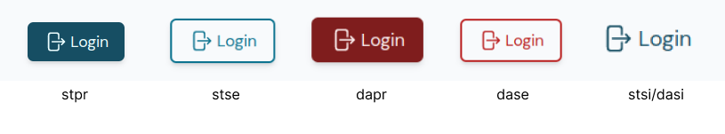
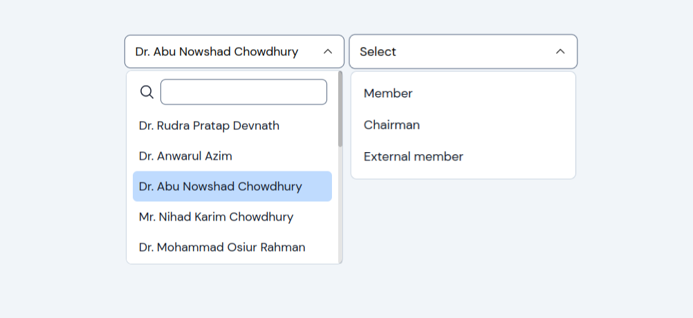

# Components

Available component categories till now:

- Dashboard
- CEC(Chairman of Exam Committee)
- Evaluator
- Root
- Home
- Login
- UI

## UI components

These components are pure components that will be used to build other components. Till now, there are -

- `Buttoncmp`: To handle different buttons
- `Dropdown` : To handle dropdown input(with search feature)
- `Inputcmp` : To handle other input options like text, number, password etc. text-box based inputs.
- `Navbar` : For navbar
- `Table` : To handle viewing and editing data on a single table.

---

### `Buttoncmp`

#### Structure

```js
<Buttoncmp {Attributes} >
// Heroicon: Must be imported
<Icon></Icon>
</Buttoncmp>
```

**Avialable attributes**

- label: The name will show on the button e.g. Login, sign up
- type: `submit`, `reset`.
- variant: To describe different styles.
  - `stpr`: Standard primary.
  - `stse`: Standard secondary.
  - `stsi`: Standard simple.
  - `dapr`: Dangerous primary.
  - `dase`: Dangerous secondary.
  - `dasi`: Dangerous simple.
- size: To describe either to take min content size(`name` plus `icon`) or the parent's container size.
- onClick: Even handler function for button click. The function should be on the parent component.
- Children: Icon should be passed as children of the component. If no icon is passed, will be ignored. The other is also true. No `name` value means to render the icon only.

**Examples**


### `Dropdown`
#### Structure
```js
<Dropdown option={options} name="role" id={id + "role"} label="Select role" search={true}>
</Dropdown>
```
**Avialable attributes**
- option: To show a option list
- name: Inside there is a input box that holds the value of the dropdown. It is recommended to provide a useful name what the dropdown does.
- id: If there is multiple dropdown in a single page. Id is used to track the specific dropdown
- label: To display information about the dropdown. e.g. Select role.
- search: boolean value to add search option or not.



### `Inputcmp`
#### Structure

```js
<Inputcmp label="" type="text/password/number/email/date" name="name" id="name" placeholder="e.g. Jane doe" onChange={eventHandler} required={false} autocomplete="name" ></Inputcmp>
```
**Available attributes**
- label
- type
- name
- id
- placeholder
- onChange: If we need to track what the user is writing on each keystroke.
- required: If the input is required or not(true or false). During form submission, it provides useful warning to the user to fill unfilled inputs.

